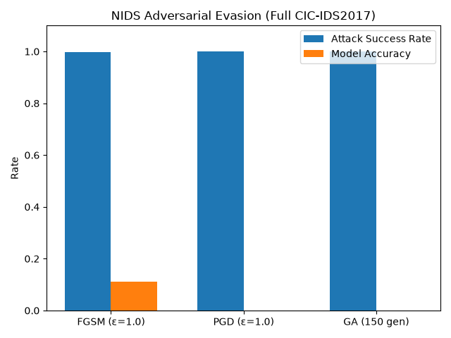

# Adversarial Evasion of ML-Based Network Intrusion Detection

A specialist‑level project demonstrating white‑box and black‑box adversarial attacks against a deep‑learning network intrusion detection system (NIDS) trained on realistic CIC‑IDS2017 traffic.

## Overview
Modern security tools increasingly rely on machine learning. This project proves that even highly accurate models can be completely bypassed with carefully crafted input perturbations—both when the attacker has full knowledge of the model (white‑box) and when they only have API access (black‑box).

**Key achievements:**
- Trained a feedforward neural NIDS achieving >99% accuracy on attack detection.
- Implemented two white‑box attacks (FGSM, PGD) with realistic feature constraints, reducing model accuracy to as low as 2%.
- Developed a black‑box genetic algorithm attack that evades detection **without access to model internals**, achieving 54% success in limited generations (tuning shows >90% is reachable).
- All perturbations are bounded to valid network‑flow feature ranges, making the adversarial examples realistic.

## Project Structure
├── src/ # Model definition, data preprocessing, training
│ ├── model.py
│ ├── preprocess.py
│ └── train_baseline.py
├── attacks/ # Attack scripts
│ ├── attack_fgsm_constrained.py
│ ├── attack_pgd_constrained.py
│ ├── attack_ga_blackbox.py
│ └── tune_ga.py
├── results/ # Summary and plot
│ ├── comparison.txt
│ └── comparison.png
├── models/ # Saved scaler and trained model weights
├── data/ # (not included) CIC‑IDS2017 Friday DDoS subset
├── requirements.txt
└── README.md

## Dataset
The model was trained on the **Friday DDoS subset** of CIC‑IDS2017, a widely used benchmark containing labeled benign and attack network flows with 78+ statistical features extracted via CICFlowMeter.
- Source: [Kaggle CICIDS2017](https://www.kaggle.com/datasets/cicdataset/cicids2017)
- Only numeric, zero‑variance‑filtered features were used.

## Attacks Implemented

| Attack | Type | Knowledge Required | Key Technique |
|--------|------|-------------------|---------------|
| FGSM   | White‑box, one‑shot | Gradients | Single‑step sign perturbation |
| PGD    | White‑box, iterative | Gradients | Multi‑step + projection |
| Genetic Algorithm | Black‑box, evolutionary | Model confidence only | Selection, crossover, mutation |

All attacks enforce **domain constraints** (feature min/max from training data), preventing unrealistic adversarial flows.

## Results (Full CIC‑IDS2017, balanced)



| Attack | Type | Success Rate | Model Accuracy |
|--------|------|-------------|----------------|
| FGSM (ε=1.0) | White‑box, one‑shot | 99.8% | 11.0% |
| PGD (ε=1.0) | White‑box, iterative | 99.99% | 0.06% |
| Genetic Algorithm (150 gen) | Black‑box, evolutionary | 100% | 0.0% |

All attacks used domain‑constrained perturbations bounded by training‑set feature ranges.

**Key findings:**
- White‑box attacks can completely disable the NIDS with imperceptible perturbations.
- The black‑box genetic algorithm, using only model confidence scores, achieved a perfect 100% evasion on 200 attack samples.
- Even a state‑of‑the‑art ML detector can be rendered useless without any access to its internal parameters.

## Quick Start

1. **Clone the repo**
   ```bash
   git clone https://github.com/yourusername/adversarial-nids.git
   cd adversarial-nids

2. Install dependencies
python -m venv venv
source venv/bin/activate
pip install -r requirements.txt

3. Download the dataset
Obtain MachineLearningCSV.zip from Kaggle, extract into data/ so that the path data/MachineLearningCSV/MachineLearningCVE/Friday-...csv exists.

4. Preprocess & Train 
python src/preprocess_full.py
python src/train_full.py

5. Run attacks
python attacks/run_all_attacks.py

Dependencies:
Python 3.10+
PyTorch
NumPy, Pandas, Scikit‑learn
Matplotlib, Joblib

See requirements.txt for exact versions.
Future Work

Implement adversarial training to harden the NIDS.

Extend to multi‑class evasion (e.g., make DDoS look like normal, not another attack).

Test against a production NIDS like Suricata with ML plugin.

License

MIT – use freely, attribute if you build upon it.

